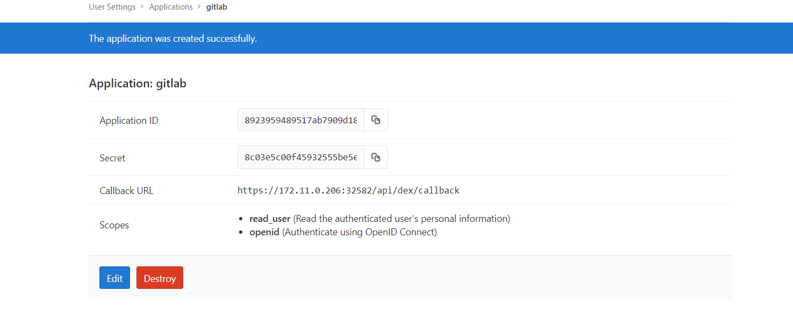
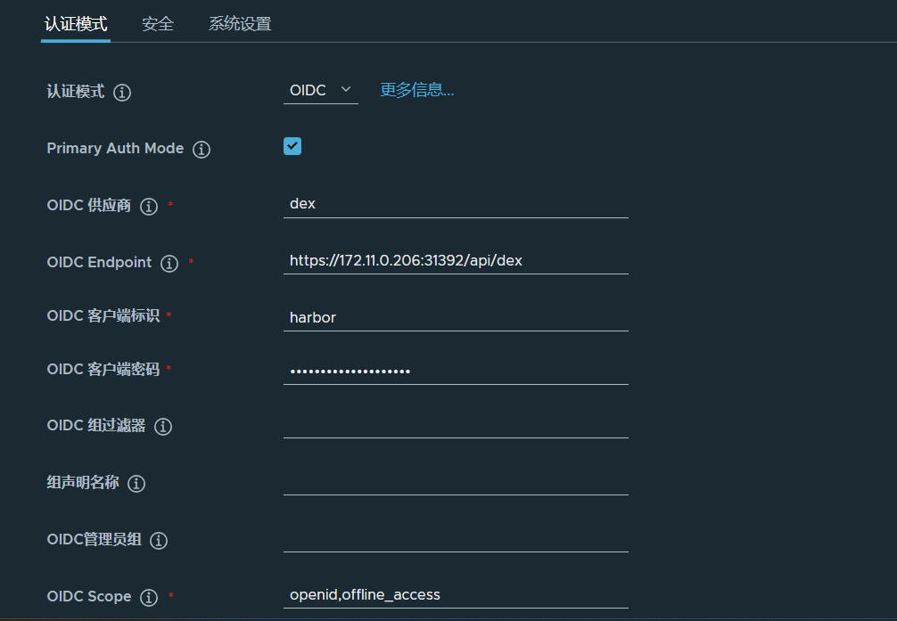
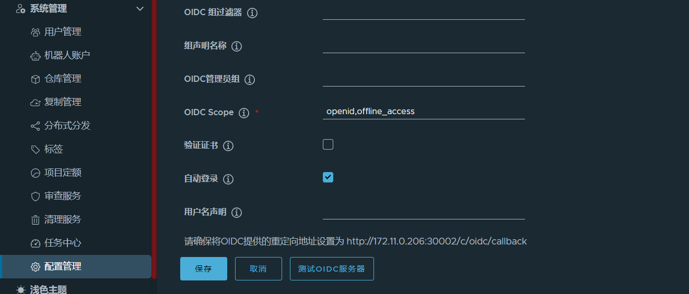

## check agocd admin password
```
kubectl -n argocd get secret argocd-initial-admin-secret -ojsonpath={.data.password} | base64 -d
```
## 关联gitlab

### create SSH Key Pair
```
ssh-keygen -o -t rsa -b 4096 -C "940200885@qq.com"
```
### copy id_rsa.pub to gitlab

### copy id_rsa to gitlab secret-repo-lgp.yaml sshPrivateKey

## argocd-cm 
### create gitlab clientID secret
User-> Settings->Applications
```
          clientID: 8923959489517ab7909d18f79bf0e62cb7c270403101ba5821d9da3c6fb6b042
          clientSecret: 8c03e5c00f45932555be5e9cf618ca0ce0b994666a85971b1bdaf44fa216f23d
```



## Set Harbor OIDC 


>Note: OIDC 客户端标识->argocd-cm.yaml->data.dex.config->staticClients. `- id: harbor`
>OIDC 客户端密码->argocd-cm.yaml->data.dex.config->connectors[x].config.clientSecret
>OIDC Scope->